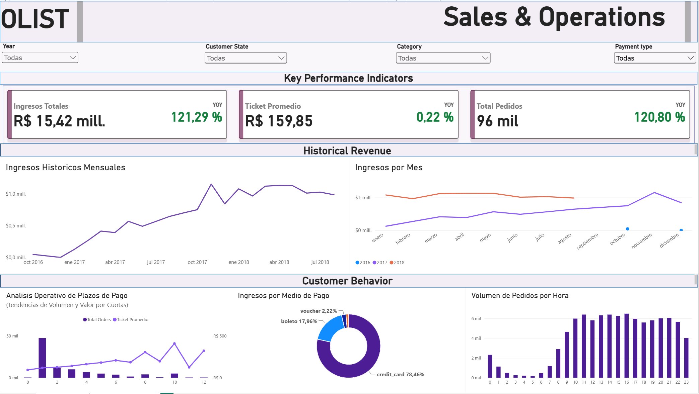
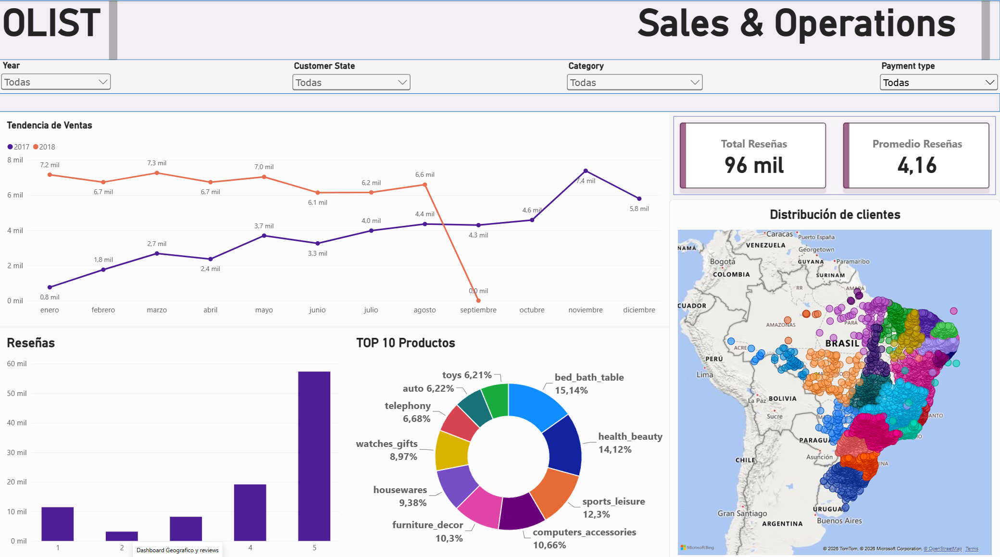

# Análisis de Rendimiento y Operaciones E-Commerce (Olist)

Este proyecto analiza el rendimiento operativo, financiero y logístico de Olist, una plataforma de comercio electrónico brasileña. El análisis abarca el ciclo completo de los datos: desde la extracción y limpieza (ETL), pasando por el análisis exploratorio con SQL, hasta la visualización en dashboards interactivos para la extracción de insights de negocio.

## 📂 Origen de los Datos
El dataset público oficial puede descargarse directamente desde Kaggle:
* [Brazilian E-Commerce Public Dataset by Olist](https://www.kaggle.com/datasets/olistbr/brazilian-ecommerce)

## 🛠️ Herramientas Utilizadas
* **Python (Jupyter Notebook, Pandas):** Procesamiento, limpieza y transformación de datos (ETL).
* **SQL:** Consultas relacionales, cálculo de métricas financieras y análisis de comportamiento.
* **Power BI:** Modelado de datos, creación de medidas DAX y desarrollo de dashboards interactivos.

## 📁 Estructura del Proyecto
* `Olist ETL.ipynb`: Notebook con el proceso de limpieza, manejo de valores nulos, estandarización de formatos y generación de las tablas finales.
* `consultas_olist.sql`: Script unificado con las consultas utilizadas para calcular tickets promedio, distribución de métodos de pago, costos de flete geográficos y tiempos de entrega.
* `olist_dashboard.pbix`: Archivo de Power BI que contiene los paneles interactivos de "Financials & Operations".
* `Reporte Olist.pdf`: Documento final estructurado con las conclusiones y recomendaciones estratégicas de negocio.

## 📊 Principales Hallazgos (Insights)
1. **Comportamiento Financiero:** Las tarjetas de crédito dominan las transacciones (74% del volumen). Existe una correlación directa entre el uso de financiamiento a largo plazo (ej. 10 cuotas) y los picos de ticket promedio alto.

3. **Impacto Geográfico y Logístico:** El estado de São Paulo concentra la mayor parte del mercado, favorecido por un costo de flete significativamente inferior al resto del país (R$ 15,14 promedio). En las regiones periféricas, el alto costo logístico actúa como barrera, limitando las transacciones a compras de ticket elevado.
4. **Satisfacción del Cliente (Reviews):** El impacto negativo en la reputación de la marca proviene de la logística, no de los productos. Un envío entregado a tiempo obtiene una calificación promedio de 4.29 estrellas; si hay un retraso, el puntaje se desploma a 2.57 estrellas.

## Archivos del proyecto
1. Ver el documento [**Reporte Olist.pdf**](https://github.com/NeoG14/Olist-Analisis/blob/main/Reporte_Olist.pdf) para acceder al resumen ejecutivo y conclusiones gráficas.
2. Puedes descargar el [**Dashboard**](https://github.com/NeoG14/Olist-Analisis/blob/main/Olist_Dashboard.pbix) **.pbix** y abrirlo con Power BI para interactuar con los filtros y marcadores del dashboard.
3. El código fuente de las [**consultas**](https://github.com/NeoG14/Olist-Analisis/blob/main/consultas%20Olist.sql) y el [**notebook**](https://github.com/NeoG14/Olist-Analisis/blob/main/Olist_ETL.ipynb) utilizado en la limpieza del dataset 
